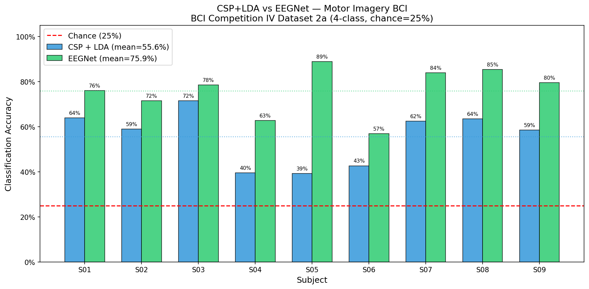

# EEG Motor Imagery BCI

Decoding what movement a person is imagining purely from their brain's electrical activity — no movement, no speaking, just thought.

Built this to learn the fundamentals of BCI signal processing and ML decoding. Uses real research-grade EEG data from 9 subjects.

## What It Does

Takes raw EEG recordings, cleans the signal, and trains classifiers to identify which of 4 movements a person was imagining: left hand, right hand, feet, or tongue. Chance level is 25% (random guessing across 4 classes).

## Results

| Subject | CSP + LDA | EEGNet | Improvement |
|---------|-----------|--------|-------------|
| S01 | 63.9% | 76.0% | +12.1% |
| S02 | 59.0% | 71.5% | +12.5% |
| S03 | 71.5% | 78.5% | +7.0% |
| S04 | 39.6% | 62.8% | +23.2% |
| S05 | 39.3% | 88.9% | +49.6% |
| S06 | 42.7% | 56.9% | +14.2% |
| S07 | 62.5% | 84.0% | +21.5% |
| S08 | 63.5% | 85.4% | +21.9% |
| S09 | 58.6% | 79.5% | +20.9% |
| **Mean** | **55.6%** | **76.1%** | **+20.5%** |

EEGNet outperformed the classical baseline on every single subject. The biggest jump was S05 — CSP+LDA barely beat chance at 39.3%, EEGNet hit 88.9%.

## Pipeline

Raw EEG → bandpass filter (0.5–40Hz) → epoch into 4s trials → extract features → classify

**CSP + LDA** — classical approach. Common Spatial Patterns finds the best electrode combinations to separate classes, Linear Discriminant Analysis draws the decision boundaries. Fast, interpretable, been the standard BCI baseline for 20 years.

**EEGNet** — compact convolutional neural network designed specifically for EEG (Lawhern et al. 2018). Only 3,444 parameters. Learns both spatial and temporal patterns directly from the raw signal.

Both evaluated with 5-fold cross-validation on BCI Competition IV Dataset 2a.

## Dataset

BCI Competition IV Dataset 2a. 9 subjects, 22 EEG channels, 288 trials per subject, 4-class motor imagery. The standard benchmark dataset in BCI research.

## Stack

- MNE — EEG processing
- PyTorch — EEGNet
- scikit-learn — CSP, LDA, cross-validation

## What's Next

- Probably maybe some variant of CSP