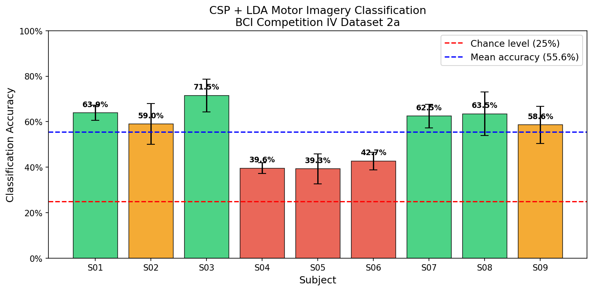

# EEG Motor Imagery BCI

Benchmarking CSP+LDA and EEGNet on BCI Competition IV Dataset 2a.

## Results — CSP + LDA Baseline

| Subject | Accuracy |
|---------|----------|
| S01 | 63.9% |
| S02 | 59.0% |
| S03 | 71.5% |
| S04 | 39.6% |
| S05 | 39.3% |
| S06 | 42.7% |
| S07 | 62.5% |
| S08 | 63.5% |
| S09 | 58.6% |
| **Mean** | **55.6%** |

Chance level: 25% (4-class problem)

## Pipeline
- Bandpass filter: 0.5–40Hz
- Epoching: 0–4s post-cue
- Feature extraction: CSP (4 components)
- Classifier: LDA
- Validation: 5-fold cross-validation

## Next: EEGNet deep learning baseline