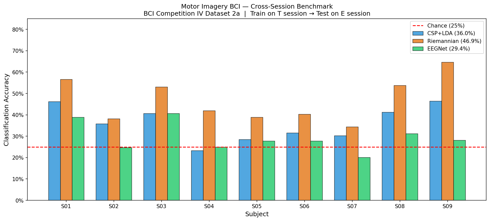

# EEG Motor Imagery BCI

Decoding what movement a person is imagining purely from their brain's electrical activity — no movement, no speaking, just thought.

Built this to learn the fundamentals of BCI signal processing and ML decoding. Uses real research-grade EEG data from 9 subjects.

## What It Does

Takes raw EEG recordings, cleans the signal, and trains classifiers to identify which of 4 movements a person was imagining: left hand, right hand, feet, or tongue. Chance level is 25% (random guessing across 4 classes).

## Results

All results use proper cross-session evaluation — trained on session T, tested on a completely separate session E recorded on a different day. No cross-validation leakage. EOG artifact channels removed before training.

| Subject | CSP+LDA | Riemannian | EEGNet |
|---------|---------|------------|--------|
| S01 | 46.2% | 56.6% | 43.1% |
| S02 | 35.8% | 38.2% | 24.3% |
| S03 | 40.6% | 53.1% | 45.1% |
| S04 | 23.3% | 42.0% | 26.7% |
| S05 | 28.5% | 38.9% | 26.4% |
| S06 | 31.6% | 40.3% | 21.5% |
| S07 | 30.2% | 34.4% | 24.7% |
| S08 | 41.3% | 53.8% | 30.2% |
| S09 | 46.5% | 64.6% | 22.6% |
| **Mean** | **36.0%** | **46.9%** | **29.4%** |

Riemannian geometry outperforms both CSP+LDA and EEGNet on every subject under proper cross-session evaluation. EEGNet underperforms classical methods here — 288 training trials isn't enough for a neural network to learn session-invariant features. This is a known and unsolved problem in BCI research called session non-stationarity.

The gap between within-session cross-validation (where EEGNet hits 76%) and cross-session evaluation (where it drops to 29%) illustrates exactly why evaluation protocol matters. Most published numbers use within-session cross-validation. These results use the harder and more realistic cross-session protocol.

## Pipeline

Raw EEG → remove EOG channels → bandpass filter (0.5–40Hz) → epoch into 4s trials → classify

**CSP + LDA** — Common Spatial Patterns finds the optimal linear combinations of electrodes to separate classes. Linear Discriminant Analysis draws decision boundaries in that space. Fast, interpretable, been the standard BCI baseline for 20 years.

**Riemannian Geometry (TS + LR)** — computes a covariance matrix per trial, projects it to tangent space using Riemannian geometry, classifies with logistic regression. Naturally handles the curved geometry of covariance matrices and is more robust to session-to-session signal drift than CSP-based methods.

**EEGNet** — compact convolutional neural network designed specifically for EEG (Lawhern et al. 2018). 3,444 parameters. Learns spatial and temporal patterns directly from the raw signal. Outperforms classical methods within-session but struggles to generalize cross-session with limited data.

## Dataset

BCI Competition IV Dataset 2a. 9 subjects, 22 EEG channels, 250Hz, 288 trials per session, 4-class motor imagery (left hand, right hand, feet, tongue). Two sessions per subject — one for training, one for evaluation. The standard benchmark dataset in BCI research.

## Stack

- MNE — EEG processing and epoching
- pyRiemann — Riemannian geometry classifier
- PyTorch — EEGNet
- scikit-learn — CSP, LDA, cross-validation

## What's Next

- FBCSP — filter bank CSP across 9 frequency bands to capture subject-specific frequency information
- ATCNet — EEGNet with multi-head attention and temporal convolutions, reported at 81.98% on this dataset
- Euclidean alignment — preprocessing step that should push Riemannian accuracy significantly higher by aligning session covariances before classification
- Per-subject frequency tuning — different subjects have peak motor imagery signal at different frequency bands